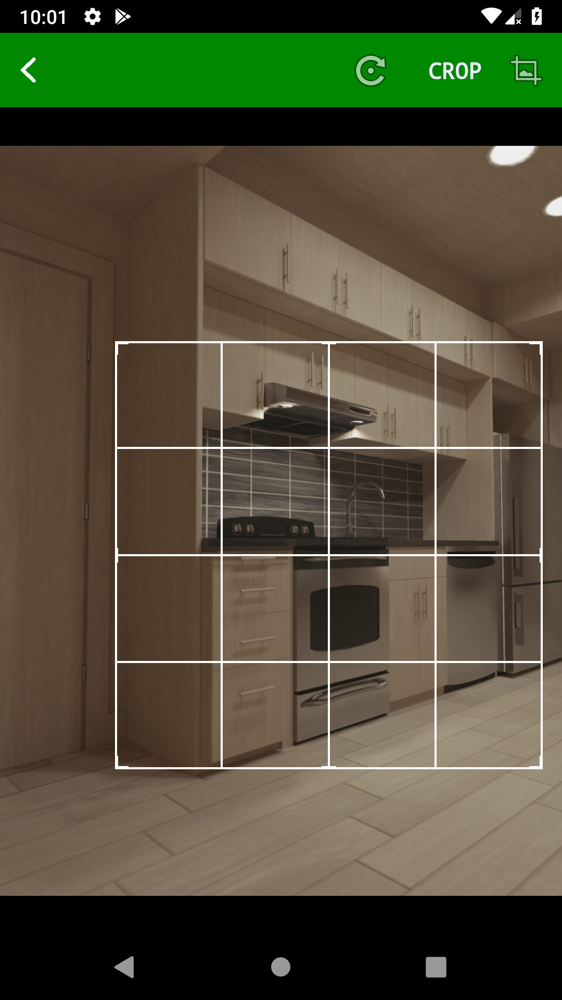
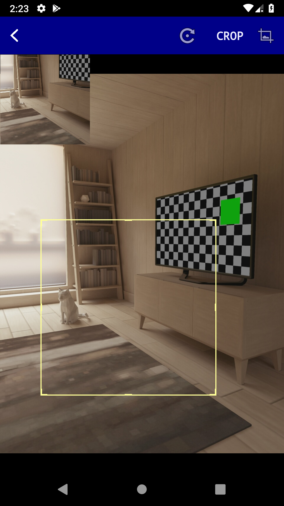
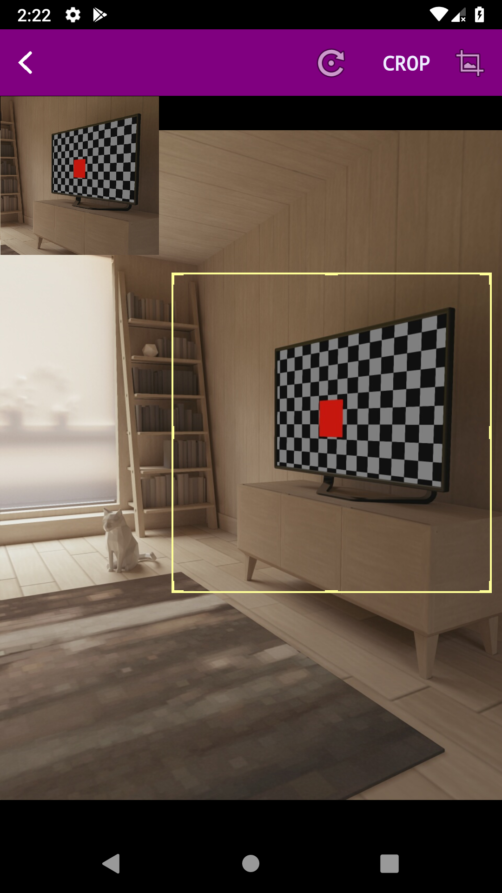
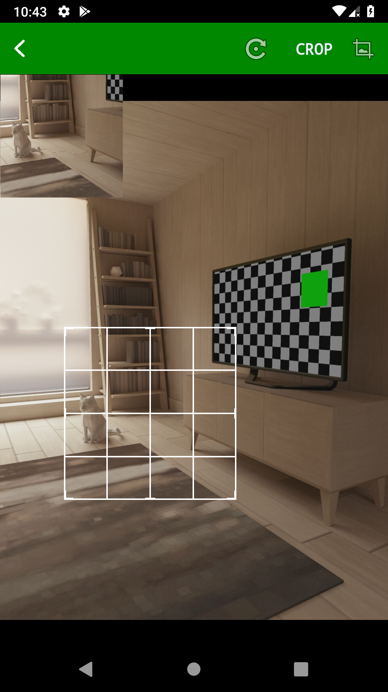

# ImagePicker
A simple image picker and cropper that works!


## Features

1. Pick images from the Camera and the Gallery over a wide range of Android APIs (tested on API 16 to API 28)
2. Simple and Efficient Cropping Tool
3. Highly configurable especially when changing cropper properties. Use your app colors on the cropper.
4. Get the image from the Uri or the File, depending on what suits you fine!


## Gradle

```
dependencies {
	        implementation 'com.github.gbenroscience:ImagePicker:${latest_version}'
	}
```

<b><i>Replace ${latest_version} with the latest version code.</i></b>


## Sample Images


 Here are some images:
 
 
 <p align="center">
  
  
  
  
  
  
</p>


### Aims and Targets

ImagePicker does not start out by trying to solve a lot of problems. It tries to do one thing; and do it well; amd that is:
Pick and crop images from the camera or gallery across a wide range of Android OS versions.

This action is highly configurable as it is evident that developers who will want to use this library will want it to look like 
their application as much as possible. For this, provision has been made for simple configurations of the cropping interface.

### How do we use this library? 
An example activity that uses the library is already provided [here](https://github.com/gbenroscience/ImagePicker/blob/master/imagepicker/src/main/java/com/itis/libs/imagepick/example/MainActivity.java)


The basic unit of action here is a well, <b>ImagePicker</b>.

Create an ImagePicker, preferably in the activity's ```onCreate``` method say: 

```java
ImagePicker picker = ImagePicker.createPicker();
```
The ImagePicker created this way has almost no configuration. You may create one with the default configuration by using:

```java
ImagePicker picker = ImagePicker.createDefaultPicker();
```

Either way, add your own configuration by doing:

```java
 picker.bgColor("#000000")
 .cropperBorderColor("#ffffff")
 .headerColor("#008800")
 .needsCrop(true)
 .showPreview(false)
 .showGrid(true)
 .cropRectThickness(4);
 ```

Now, let your activity implement <b>ImagePickedListener</b> and provide concrete definitions for its methods in the body of the 
Activity:

```java

    @Override
    public void onImagePicked(Uri uri, File file) {
  
    }

    @Override
    public void onPickerError(int errorCode) {

    }
```


### MODES OF OPERATION

ImagePicker can be called in 3 ways:

1. Direct calls to camera for images(Opens the camera directly from your app)
2. Direct calls to the gallery(Opens the Gallery directly from your app)
3. Chooser mode(Shows a simple dialog asking if you would open either the camera or the gallery)

#### Open the camera

To use any ImagePicker object, say `picker` (which you have configured as you wish), to open the device camera directly from an Activity; say `activity` in your application, all you need is:

```java
picker.openCamera(activity)
```
#### Open the gallery

To use any ImagePicker object, say `picker` (which you have configured as you wish), to open the device's image gallery directly from an Activity; say `activity` in your application, all you need is:

```java
picker.openGallery(activity)
```
#### Choose between opening the gallery and the camera

To use any ImagePicker object, say `picker` (which you have configured as you wish), to show a simple popup which presents the user with the option to choose between opening the device's image gallery and the camera from an Activity; say `activity` in your application, all you need is:

```java
picker.openChooser(activity)
```
        
  
    

Instances of an <b>ImagePicker</b> know how to pick images. Once the picking is done, the library notifies your application by 
calling the method: ImagePickedListener.onImagePicked(Uri uri, File file). 
If an error occurred while picking the image, it calls the: <b>ImagePickedListener.onPickerError(int errorCode)</b> method.

In essence, to crop an image into an ImageView in an Activity, say ImageActivity:


```java
public class ImageActivity extends Activity implements ImagePickedListener{

private ImagePicker picker;

private ImageView picView;
private Button attachImageBtn;


   @Override
    protected void onCreate(Bundle savedInstanceState) {
        super.onCreate(savedInstanceState);

        AppCompatDelegate.setCompatVectorFromResourcesEnabled(true);
        setContentView(R.layout.activity_main);
        
        picView = findViewById(R.id.pic);//get your image-view
        attachImageBtn = findViewById(R.id.attach);//get the button you click to trigger the picker
        
          picker = ImagePicker.createPicker();

        picker.bgColor("#000000").cropperBorderColor("#ffffff").headerColor("#008800").needsCrop(true).showPreview(false).showGrid(true).cropRectThickness(4);

        picker.setImagePickedListener(this);

        addBtn.setOnClickListener(new View.OnClickListener() {
            @Override
            public void onClick(View v) {
                //picker.openGallery(MainActivity.this);
                // picker.openCamera(MainActivity.this);
                picker.openChooser(MainActivity.this);

            }
        });
 


    }

  @Override
    public void onImagePicked(Uri uri, File file) {
  
    }

    @Override
    public void onPickerError(int errorCode) {

    }
    
}
```
For developer convenience, the onImagePicked method makes available both a Uri and a File reference to the image.


 ## Configuration Options 
 
 Note that the color configuration methods take hexadecimal color strings.
 
 #### .bgColor 
 Sets the background color of the cropper
 
 #### .cropperBorderColor 
 Sets the border color and the grid color(if enabled) of the cropping square
 
 #### .headerColor 
 Sets the background color of the cropper page's header area.
 
 #### .bgColor 
 Sets the background color of the cropper
 
 #### .needsCrop 
 If this is set to true, the developer wants the library to open the cropping page once the image has being picked from the
 camera or the gallery. If false, the library picks the image from either and returns the resource to the calling application.
 
 #### .showPreview 
 If set to true, a live preview of the cropped area is shown on the cropping page as the user is selecting the area of the 
 image to be cropped. If false, the preview is not shown. 
 
 #### .showGrid 
 If true, the cropping square is shown with an embedded grid. If false, it isn't.
 
 #### .cropRectThickness
 Is the method that sets the thickness of the cropping square's border and grid(if any).
 

